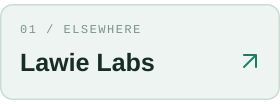
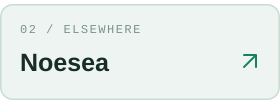
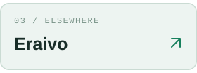
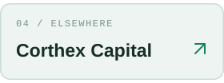
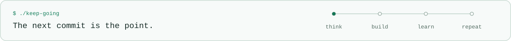

<!--
  John Formanek / Signal over noise.
  Profile repository: john-formanek-code/john-formanek-code
  Keep the assets/ directory alongside this README.
  Artwork is self-contained: no image services, API keys, or Actions required.
-->

<picture>
  <source media="(prefers-color-scheme: dark) and (max-width: 600px)" srcset="./assets/hero-dark-mobile.svg" />
  <source media="(prefers-color-scheme: light) and (max-width: 600px)" srcset="./assets/hero-light-mobile.svg" />
  <source media="(prefers-color-scheme: dark)" srcset="./assets/hero-dark.svg" />
  
</picture>

 

  <a href="https://github.com/john-formanek-code?tab=repositories"><b>Explore the code ↗</b></a>
  &nbsp;&nbsp; / &nbsp;&nbsp;
  <a href="https://github.com/john-formanek-code?tab=stars">Follow the curiosity ↗</a>

 

01   /   The mindset

Curiosity is the starting point. Building is the answer.

I'm John. I'm drawn to software, artificial intelligence, and the way financial markets work. This is where ideas become experiments — and experiments become code.

~/operating-principles
|
+-- 01   Ask better questions.
+-- 02   Build something worth opening.
+-- 03   Keep the details sharp.
`-- 04   Think in years. Improve in commits.

 

02   /   Beyond the commit

Not everything fits inside a repository.

  <a href="https://lawielabs.com">
    <picture>
      <source media="(prefers-color-scheme: dark)" srcset="./assets/link-lawie-dark.svg" />
      
    </picture>
  </a>
  <a href="https://noesea.com">
    <picture>
      <source media="(prefers-color-scheme: dark)" srcset="./assets/link-noesea-dark.svg" />
      
    </picture>
  </a>
  <a href="https://eraivo.com">
    <picture>
      <source media="(prefers-color-scheme: dark)" srcset="./assets/link-eraivo-dark.svg" />
      
    </picture>
  </a>
  <a href="https://corthexcapital.com">
    <picture>
      <source media="(prefers-color-scheme: dark)" srcset="./assets/link-corthex-dark.svg" />
      
    </picture>
  </a>

 

  
<b>A note on the quiet days</b>

   

Not every idea starts with a public commit. Sometimes the work is learning, thinking, or starting over. The graph is a trace — not the whole story.

When I disappear, I'm probably plotting something bigger.

 

<picture>
  <source media="(prefers-color-scheme: dark) and (max-width: 600px)" srcset="./assets/footer-dark-mobile.svg" />
  <source media="(prefers-color-scheme: light) and (max-width: 600px)" srcset="./assets/footer-light-mobile.svg" />
  <source media="(prefers-reduced-motion: reduce) and (prefers-color-scheme: dark)" srcset="./assets/footer-dark-static.svg" />
  <source media="(prefers-reduced-motion: reduce) and (prefers-color-scheme: light)" srcset="./assets/footer-light-static.svg" />
  <source media="(prefers-color-scheme: dark)" srcset="./assets/footer-dark.svg" />
  
</picture>
